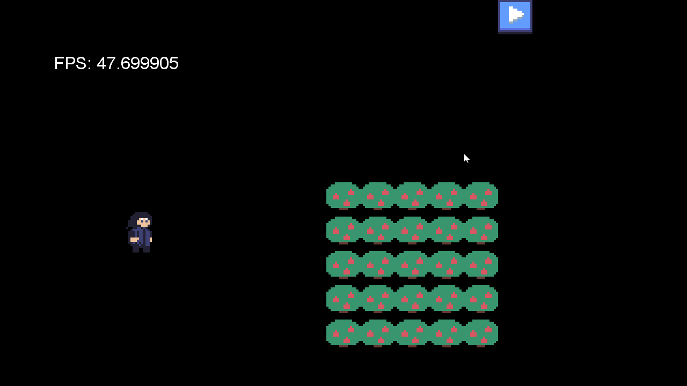
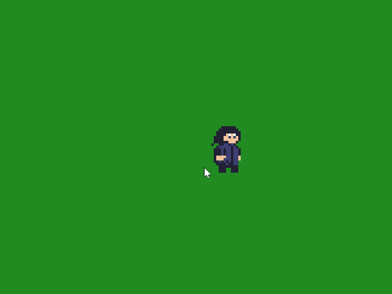

# MonoECS

An Entitiy Component System for monogame,

(systems are called services oops)

Currently working on creating standard components and service for rapid prototyping game mechanics.

Data oriented design makes parallel process simpler, the destination position component manipulator is a parallel service.

Features
 - [x] particle emitter
 - [x] particles
 - [x] player controller
 - [x] entity lifetime manager
 - [x] animation queue with named actions and delays between keyframes
 - [ ] enemy AI
 - [ ] health
 - [ ] screens (ui? html?)
 - [ ] events
 - [ ] physics
 - [ ] game map
